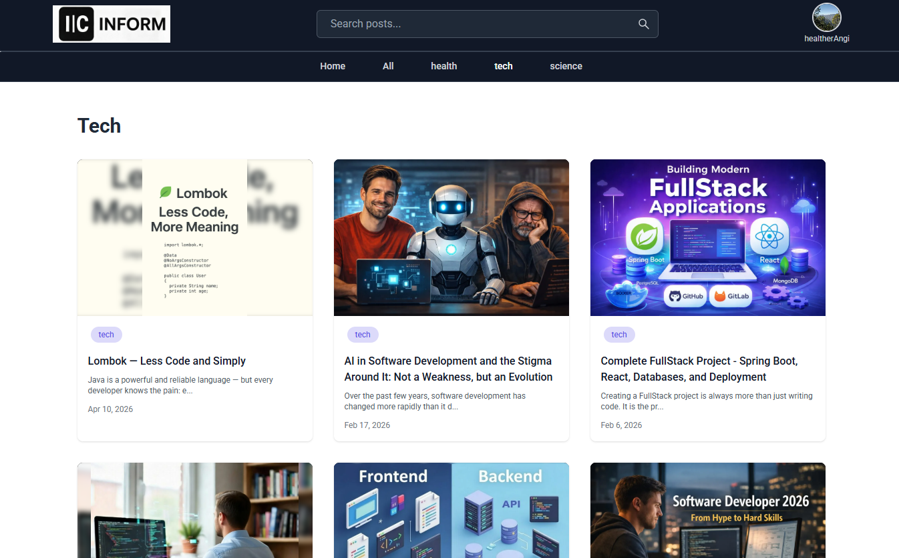
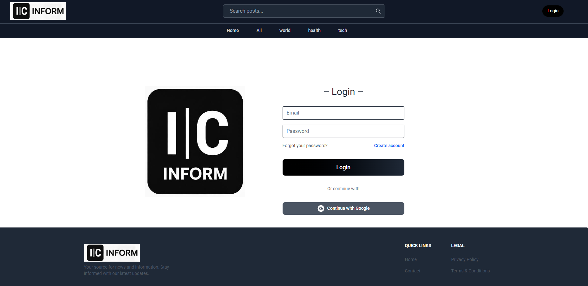
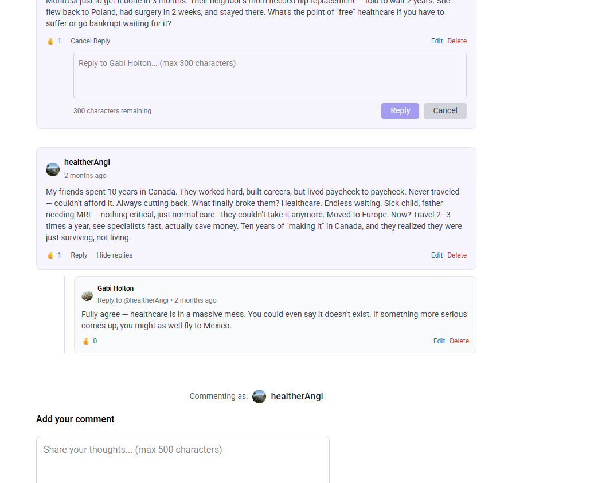
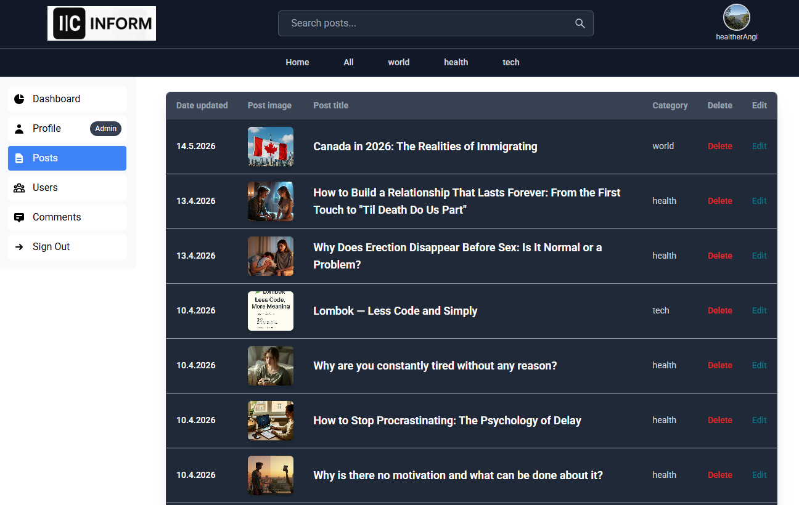
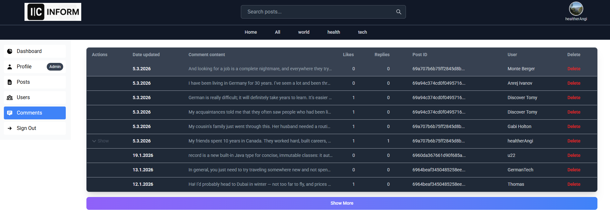

# IC-Inform — Fullstack Information & News Portal

IC-Inform is a high-performance information portal built with the MERN stack. This project represents a complete ecosystem featuring a sophisticated multi-level commenting system, secure user authentication, and a robust administrative dashboard. The entire development cycle—from database architecture to SEO optimization—was handled by a single developer.

**Live Demo:** [icinform.com](https://icinform.com)

## Tech Stack
* **Frontend:** React.js, Tailwind CSS / SASS
* **Backend:** Node.js, Express.js
* **Database:** MongoDB Atlas (NoSQL)
* **Media Storage:** ImageKit.io (Real-time image optimization and delivery)
* **Authentication:** JWT, Google OAuth 2.0, Firebase Auth
* **Communications:** Nodemailer (Email verification and password recovery)
* **SEO:** React Helmet (Metadata and Open Graph optimization)
* **Hosting:** Vercel

## Key Features
* **Content Management:** Advanced system for publishing posts with category and tag associations.
* **Advanced Commenting System:** Support for threaded (nested) replies, likes, and user-driven comment management.
* **User Experience:** Secure registration via Email or Google, email verification flow, and automated password recovery.
* **Admin Dashboard:** A powerful interface for real-time moderation of users, posts, and comments.
* **SEO & Social Integration:** Full search engine optimization with dynamic meta-tag generation for high social media visibility.

## Technical Implementation
* **Complex Data Modeling:** Implemented intricate MongoDB relationships to handle nested comment threads and like counters efficiently.
* **Security:** Secured API routes using JWT and protected frontend routes. Environment variables are used to protect all sensitive keys.
* **Scalable Storage:** Integrated ImageKit.io to ensure fast image loading through CDN and automatic resizing.
* **Search Optimization:** Configured dynamic SEO headers for every individual post to ensure proper Google indexing and professional previews for social sharing.

## Screenshots

### Main Interface
| | |
|---|---|
|  |  |
| *Main Portal Feed* | *Individual Article View* |

### User Interaction
| | |
|---|---|
|  |  |
| *Authentication (Email/Google)* | *Threaded Comments & Likes* |

### Administrative Panel
| | |
|---|---|
|  |  |
| *Content Management System* | *Comment Moderation Interface* |

---
*Developed as a full-scale production portal for content distribution and community engagement.*
